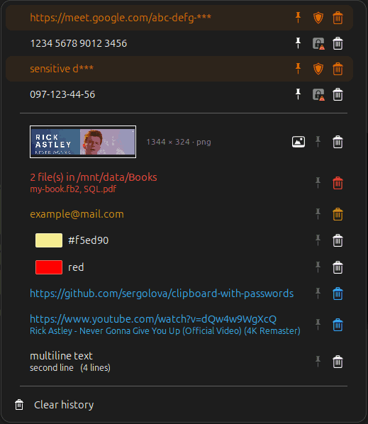
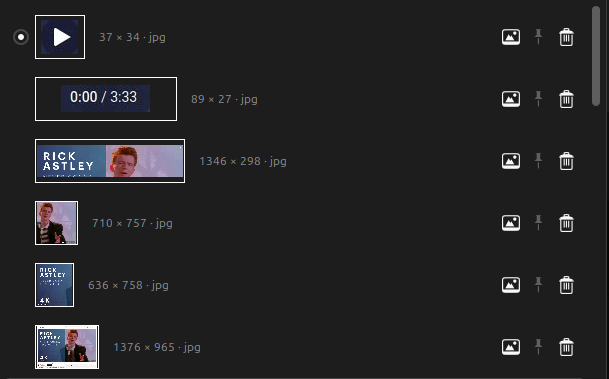
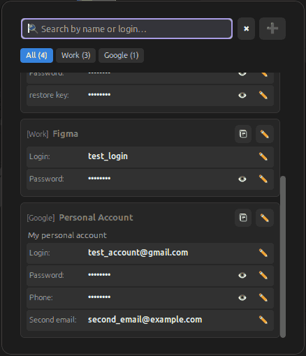
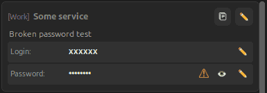
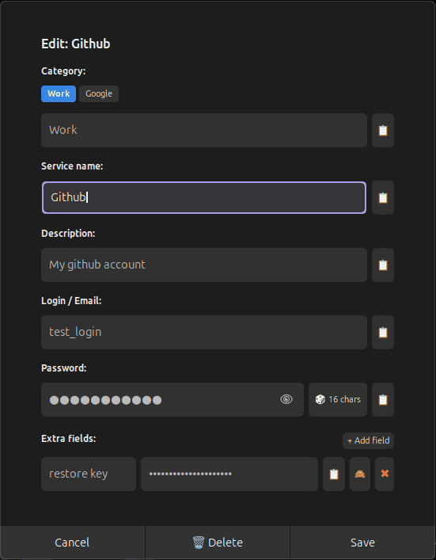
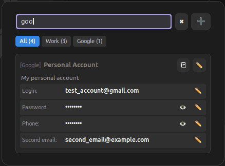
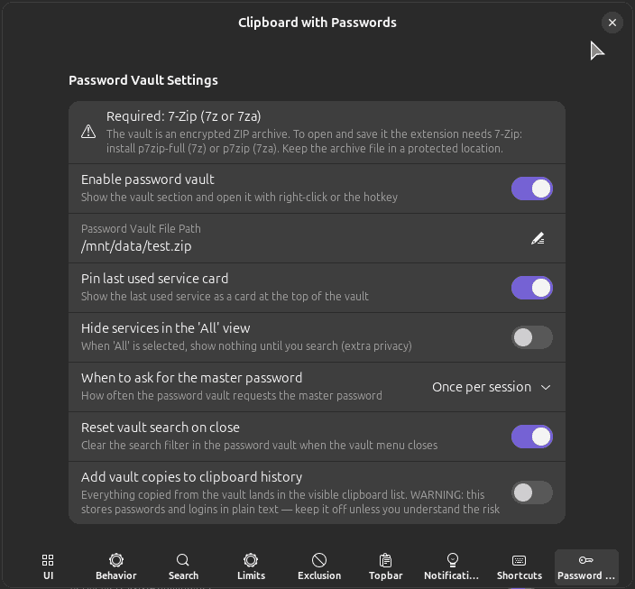

# 🔐 Clipboard with Passwords

A fork of the popular [Clipboard Indicator](https://github.com/Tudmotu/gnome-shell-extension-clipboard-indicator) (v71) for GNOME Shell, extended with a **built-in encrypted password manager**.

Forked from: [Tudmotu/gnome-shell-extension-clipboard-indicator](https://github.com/Tudmotu/gnome-shell-extension-clipboard-indicator) (extension UUID: `clipboard-indicator@tudmotu.com`)
This extension UUID: `clipboard-with-passwords@sergolova`.

---

## ✨ What's new compared to the original

### 🧠 Smart clipboard content recognition
Clipboard entries are detected and visually distinguished by their content type, each with its own accent color in the menu:

| Type                | Example                                                                               |
|---------------------|---------------------------------------------------------------------------------------|
| **E-mail**          | `user@example.com`                                                                    |
| **URL**             | `https://github.com`                                                                  |
| **YouTube URL**     | `https://www.youtube.com/watch?v=dQw4w9WgXcQ` with video title                        |
| **File list**       | dragged/copied files show the file names                                              |
| **Multi-line text** | shows a preview of the non-empty lines with line count                                |
| **HTML/CSS colors** | predefined color names + hex codes (`#ff5500`,`#f50`) get a real color swatch preview |
| **Images**          | proportional thumbnails with size & format, full-screen preview on hover         |

<p align="center">
  
</p>

Type-based coloring can be turned off in the settings («Colorize clipboard content»).

Image previews: see the dedicated [🖼️ Image previews](#image-previews) section below.

For copied **YouTube links**, the video title can be fetched via the YouTube oEmbed API and shown under the URL. This is **off by default** and enabled in the settings («Fetch YouTube video titles»). ⚠️ **Enabling it sends the copied YouTube link (clipboard data) to a third party** — `https://www.youtube.com/oembed` (see [Network access](SECURITY.md#network-access)).

<a name="image-previews"></a>

### 🖼️ Image previews
Image items get a **proportional thumbnail** — non-square images are no longer squeezed into a square (that is what the original extension did, visibly distorting the picture):

- The thumbnail lives in a **fixed-height rectangle** (the width follows the image, up to **150px**): wide images fill the full height, tall and panoramic ones are fitted inside proportionally — nothing is cropped, stretched or letterboxed. Rows keep a constant height.
- Next to the thumbnail the menu shows the image **size and format**, e.g. `1920 × 1080 · jpg` — read from the same texture that renders the thumbnail, so it costs nothing extra.
- **Hover** over the preview button for a quick **full-screen look** (auto-dismisses when the pointer leaves). The hover behavior can be turned off in the settings («Preview on hover») — the click/keyboard (`h`) interactive preview always works.

<p align="center">
  
</p>

### 🎭 Privacy mask for pinned items
Pinned (favorite) text items can be **masked** with a single click (`Apply privacy mask`). The last **3 characters** of the item are then replaced with `***` everywhere it is displayed — in the menu and in the topbar preview. Handy for passwords and other sensitive data during meetings and screen recordings. The mask is a **display-only** feature: the full value stays stored and readable (in the vault and in the item's own entry) — it is **not** encryption.

### 🔐 Built-in password manager
- Sensitive data is stored in a **separate encrypted ZIP archive** at a user-defined path (default `~/.config/clipboard-with-passwords/storage.zip`).
- The archive is a **standard encrypted ZIP** — it can be read and edited outside the extension (see [The vault archive](#-the-vault-archive)).
- The archive contains a single `data.json` file, which can also be edited manually.
- Access is protected by a **master password**.

<p align="center">
  
</p>

> 🖱️ **Left-click** on the panel icon opens the regular clipboard list; **right-click**
> opens the password vault (or use the «Toggle Password Vault» shortcut — it has
> **no default keybinding**, assign one in the extension settings). The whole
> vault feature can be turned off in the settings («Enable password vault»).

> ⚠️ **«Add vault copies to clipboard history»** — everything copied from the
> vault (*logins, passwords, custom fields, «copy all»*) is also added to the
> visible clipboard list. That list is stored in plain text — this is
> **insecure** by definition (see [Clipboard & history](SECURITY.md#clipboard-history)).
> Default: off.

> 🧹 **Auto-clear after vault copy (default: on, 20 s)** — a secret copied from
> the vault is wiped from the system clipboard after a short delay, *provided
> the clipboard still holds exactly that value* (content you copied in the
> meantime is never touched). This matches the behavior of KeePassXC /
> Bitwarden and closes the "password lingers in the clipboard" vector. Both the
> delay and the feature itself are configurable in Settings → Password Vault.

### 🏷️ Flexible service records
- Besides the standard **login** and **password**, each service supports **arbitrary custom fields** (e.g. 2FA code, PIN, recovery key).
- Each custom field can be **hidden** (shown as `••••••••`, toggleable with one click).
- **Hidden-field edge warning (opt-in, off by default)** — a ⚠️ warning icon
  can be shown next to any hidden value (password or custom field) that
  **starts or ends with a space, a line break or a non-printable character**
  (zero-width space, BOM, control char…). Such edge characters are invisible
  behind the dots and are almost always a typo (stray space, paste artifact) —
  the icon makes them visible at a glance. It is **off by default** because the
  icon also reveals *metadata* about the secret value to anyone viewing the
  screen (e.g. during screen sharing); enable it in the settings
  («Hidden-field edge warning»).

<p align="center">
  
</p>

Card buttons (vault):

| Icon | What it does |
| --- | --- |
| 👁️ / 🙈 | Reveal / hide the hidden value |
| ✏️ | Open the service in the edit dialog |
| ⚠️ | **Warning indicator** — the hidden value has invisible leading/trailing characters (see above); not a button |

Dialog buttons (service edit dialog):

| Icon | What it does |
| --- | --- |
| 📋 | Paste the current clipboard content into the focused field (X11 workaround for Ctrl+V) |
| 🎲 | Generate a cryptographically secure 16-character password (CSPRNG: draws from `/dev/urandom` via Gio, rejection sampling — `Math.random` is not used for anything secret) |
| ➕ | Add a custom field |
| 🗑️ | Delete the service |
| ✖ | Close the dialog |

<p align="center">
  
</p>

### 🔍 Vault search & filter
- Convenient filter to search services **by name, description and login** (also matches category and custom field labels/values).
- Categories with no services are hidden automatically; the bar re-layouts to fill the menu width.
- The **last used service** stays pinned at the top of the vault for quick access — pinning can be disabled in settings («Pin last used service card»).
- **«All» privacy mode** — with the setting «Hide services in the 'All' view» the vault shows *nothing* when the «All» category is selected; entries appear only while you type in the search box, and category counts are hidden as well.
- **Search filter resets on close** by default («Reset vault search on close»): closing the vault menu clears the search box, so the next open starts with the full list. Disable the setting if you want the query to persist between opens.

<p align="center">
  
</p>

### 📋 Convenience
- **«Copy all»** (🗐) button — copies login, password and all custom fields at once, formatted as `key: value` multi-line text.
- **Paste buttons** (📋) — insert the current clipboard content into dialogs on **X11**, where native Ctrl+V may silently fail inside shell dialogs.
- Clipboard menu: pinned and regular history are separated by a proper divider.

---

## Requirements

- **GNOME Shell 46 – 50**
- **7-Zip** — used to encrypt and decrypt the vault archive. The extension looks
  for the `7z` command first, then falls back to `7za` (both work with the encrypted
  ZIP format; `7zr` does **not** support ZIP and is ignored).
  - Ubuntu / Debian: `sudo apt install p7zip-full` (provides `7z`; `p7zip` provides `7za`)
  - Fedora: `sudo dnf install p7zip` (provides `7za` and `7zr`)
  - Arch Linux: `sudo pacman -S p7zip` (provides `7z` and `7za`)
- Paste buttons inside dialogs work on **X11** (on Wayland the standard clipboard flow is used).

## Installation

The extension installs as a plain directory under GNOME's extensions folder:
`~/.local/share/gnome-shell/extensions/clipboard-with-passwords@sergolova/`.
Pick the way that fits you:

### 📦 From a downloaded ZIP

Download the repository as a ZIP from GitHub (green **Code ▾ → Download ZIP**
button, or [this direct link](https://github.com/sergolova/clipboard-with-passwords/archive/refs/heads/clipboard-with-passwords.zip)),
then unpack and copy it:

```bash
mkdir -p ~/.local/share/gnome-shell/extensions

unzip clipboard-with-passwords-clipboard-with-passwords.zip
cp -r clipboard-with-passwords-clipboard-with-passwords \
    ~/.local/share/gnome-shell/extensions/clipboard-with-passwords@sergolova
```

### 🖥️ One-liner via `curl`

Same result without the browser — download the ZIP and unpack it straight into
the extensions folder:

```bash
mkdir -p ~/.local/share/gnome-shell/extensions

curl -L https://github.com/sergolova/clipboard-with-passwords/archive/refs/heads/clipboard-with-passwords.zip \
    -o /tmp/clipboard-with-passwords.zip
unzip -oq /tmp/clipboard-with-passwords.zip -d /tmp/clipboard-with-passwords
cp -r /tmp/clipboard-with-passwords/clipboard-with-passwords-clipboard-with-passwords \
    ~/.local/share/gnome-shell/extensions/clipboard-with-passwords@sergolova
```

> 🛡️ **Verify what you are downloading.** `curl` fetches the ZIP over HTTPS and
> unpacks it, but nothing else protects you from a tampered archive — compare
> the file size against the ZIP from GitHub's web UI, or `sha256sum` it against
> a value only you trust. Code you install runs with **your user's privileges**
> (see [Trust model](SECURITY.md#trust-model)).

### 🧑💻 For development (symlink to a source checkout)

Developers keep a symlink so edits are live on disk (JS is loaded from the
symlinked repo — see `AGENTS.md`):

```bash
mkdir -p ~/.local/share/gnome-shell/extensions
ln -s /path/to/clipboard-with-passwords \
    ~/.local/share/gnome-shell/extensions/clipboard-with-passwords@sergolova
```

A symlinked copy needs the **compiled schema and translations** — build them
from the checkout first:

```bash
glib-compile-schemas --strict --targetdir=schemas/ schemas
make
```

### ▶️ After installing (any method)

Restart the shell (`Alt+F2` → `r`) or log out and back in, then enable the
extension in **GNOME Extensions** (or with
`gnome-extensions enable clipboard-with-passwords@sergolova`).

> ℹ️ Windows/menus are auto-created on first use. History and settings are stored under
> `~/.cache/clipboard-with-passwords@sergolova` and in the GSettings schema
> `org.gnome.shell.extensions.clipboard-indicator` respectively.

## 🔐 The vault archive

The vault is a standard encrypted archive (ZIP by default) containing a single `data.json` file.
The extension uses the `7z` command (or `7za` as a fallback) for both encryption and decryption.

> 🔐 **How the vault is protected** — AES-256 encryption, master-password
> handling (never on the command line), file permissions, the crypto trade-off
> and the trust model — is documented in **[SECURITY.md](SECURITY.md)**.
> One practical note: classic Info-ZIP `unzip` cannot read AES-encrypted ZIPs —
> use `7z`/`7za` (as documented below), WinRAR or Explorer.

### 📦 Archive format: ZIP or 7z

Both formats are always AES-256 encrypted, and the choice is in *Settings →
Password Vault → «Use 7z vault format»*. The extension **answers to the
content, not to the file name**: on every open it detects the actual container
from the archive's magic bytes (`PK\x03\x04` = ZIP, `37 7A BC AF 27 1C` = 7z —
visible even with encrypted headers) and operates on that format. A 7z archive
stored in a `.zip`-named file is renamed to match (and the stored path in
Settings follows), so the extension can never silently write a 7z archive into
a file that claims to be ZIP.

| | ZIP (default) | 7z |
|---|---|---|
| Portable | ✅ opens with any ZIP tool | ❌ 7-Zip only |
| Hides the internal file name (`data.json`) and sizes | ❌ visible in the headers | ✅ encrypted headers |
| Practical benefit | manual inspection/repair with any tool | nobody can learn *what* is stored or how big it is from the file alone |

- **New vault** — created in the format selected in Settings; the archive name
  follows the format from the very first byte (`storage.7z`, not a `.zip`-named
  7z archive). A custom non-`.zip`/`.7z` name is kept as-is.
- **Existing vault** — the format on disk is the source of truth. When you
  switch the toggle, the vault is **converted the next time it is opened with
  the master password**: the whole archive is rewritten in the new format and
  renamed to match (`storage.zip` ↔ `storage.7z`); the stored path in Settings
  is updated in the same step, and you get a notification.
- **After a conversion** the old-format file remains next to the archive (its
  `.bak` too) as a leftover copy — delete it once you have confirmed the new
  archive opens.
- **A freshly written archive is verified before it replaces the previous
  one**: the extension checks the container magic and decrypts the new archive
  back to exactly the JSON it just serialized. A `7z` run that died mid-write
  (or a file that ended up 0 bytes, e.g. after a drive failure) can therefore
  never overwrite a healthy vault — the previous archive and its `.bak` stay
  intact and the save fails with a clear error.

Working with the archive manually:

```bash
# list the contents (format is detected automatically)
7z l ~/.config/clipboard-with-passwords/storage.zip

# extract the JSON to the current directory (you will be prompted for the master password)
7z x ~/.config/clipboard-with-passwords/storage.zip

# extract the JSON to stdout and save it
7z x -so ~/.config/clipboard-with-passwords/storage.zip > data.json

# write the file back into an AES-256 ZIP (the extension's default format)
7z a -tzip -mem=AES256 -p"YOUR_MASTER_PASSWORD" ~/.config/clipboard-with-passwords/storage.zip data.json

# write the file back as 7z with encrypted headers
7z a -t7z -mhe=on -p"YOUR_MASTER_PASSWORD" ~/.config/clipboard-with-passwords/storage.7z data.json
```

Each save also keeps a `.bak` copy of the previous archive next to it.

Saves are **atomic**: the archive is first written to a temporary file next to
it (`storage.zip.tmp-<timestamp>`, same directory ⇒ same filesystem) and then
renamed over the target with `GLib.rename`. A crash or power loss in the middle
of a save leaves the previous archive (and its `.bak`) intact — never a
half-written `storage.zip`.

### Example `data.json`

```json
{
  "version": 1,
  "items": [
    {
      "id": "service_1737528540000_123",
      "name": "GitHub",
      "category": "Work",
      "description": "Primary Developer Account",
      "login": "sergolova",
      "password": "s3cret-p@ss",
      "extraFields": [
        { "label": "2FA", "value": "384729", "isHidden": true },
        { "label": "PIN", "value": "5531" }
      ],
      "updatedAt": 1737528540000
    }
  ]
}
```

Empty and `false` fields are **omitted entirely**: an optional field (`category`,
`description`, `login`, `password`, `extraFields`) is only written when it has a
value, `extraFields[].label` is omitted when empty, and
`extraFields[].isHidden` is omitted when `false`. The file can be edited by
hand — categories shown in the filter bar are derived automatically from the
items, so there is no fixed `categories` list to maintain.

**`id` is optional on input and safe to duplicate.** When the vault is opened,
every record is loaded, and any record that has no `id` or shares one with an
earlier record gets a fresh unique id (nothing is dropped, both cards stay).
Saved files always contain a unique `id` per record, so id-based operations —
editing, deleting, pinning the last used service — always affect exactly one
card.

Field reference:

| Field | Type | Description |
| --- | --- | --- |
| `version` | int | Archive format version (`1`) |
| `items[].id` | string | _Optional._ Unique service identifier. If omitted, the extension generates one; two records sharing the same id (e.g. after copy-paste editing) are split — the second gets a fresh id, both cards survive |
| `items[].name` | string | Service name (shown as the card title) |
| `items[].category` | string | _Optional._ Category this service belongs to (omitted when empty) |
| `items[].description` | string | _Optional._ One-line description, searchable (omitted when empty) |
| `items[].login` | string | _Optional._ Login / e-mail (omitted when empty) |
| `items[].password` | string | _Optional._ Password (omitted when empty) |
| `items[].extraFields[]` | object[] | _Optional._ Custom fields: `label`, `value`, `isHidden` (array omitted when empty) |
| `items[].updatedAt` | int | Unix timestamp of the last modification |

## 🔑 Master password & session lifecycle

**When the master password is requested.** The password is asked only when the
vault is opened (the «Toggle Password Vault» shortcut, right-click the panel
icon, or the menu item) and is **not unlocked yet**. How often the password is
requested is configurable (*Settings → Password Vault → «When to ask for the
master password»*):

| Mode | Behavior |
| --- | --- |
| **Once per session** (default) | The master password is asked once; the vault stays unlocked in memory for the whole session, so you are **not** prompted on every open. |
| **After system sleep** | Like the default, **but** a plain screen lock (wallpaper / `Super+L`) is *not* enough to re-lock the vault — the master password is requested again **only** after the machine actually wakes from sleep. |
| **Every time the vault is opened** | The master password is requested on **every** opening, even if the vault is still unlocked in memory. |

**Screen lock & suspend.** By default the vault is **auto-locked** when the
screen locks (wallpaper / `Super+L`) and when the machine goes to sleep: the
vault menu (if open) closes, a «vault locked» notification is shown, and the
master password is required again after waking up. In **«After system sleep»**
mode only a real suspend triggers this auto-lock. The vault is also locked when
the vault file path in the settings is changed while the vault was unlocked —
the new path is never written to without re-authentication.

**Logout / shell restart / reboot.** Nothing extra needs to be done — every
change is saved to the archive immediately, so the file on disk is always the
latest state. When the session ends the in-memory copy disappears and the vault
is effectively locked; the master password is requested again on the next
session.

**The archive is deleted while the extension is running.**
- If the vault is **unlocked** (the usual case mid-session): all services are
  kept in memory, and the next save simply recreates the archive with all the
  data (a fresh `.bak` is made from the previous state if it still existed).
- If the vault is **locked** when the file disappears (e.g. after auto-lock on
  suspend): unlocking creates a **new empty** vault for that master password.
  Your previous data is not destroyed though — the `storage.zip.bak` from the
  last save (if any) is still on disk, and can be restored manually:

```bash
# recover the previous archive from the backup copy
cp ~/.config/clipboard-with-passwords/storage.zip.bak ~/.config/clipboard-with-passwords/storage.zip
```

**Invalid path or a write-protected file.** If the «Password vault file path»
setting points somewhere that cannot be used — a directory instead of a file,
a folder that cannot be created, a read-only file or directory, or a missing
`7z`/`7za` binary — the unlock dialog shows a clear message instead of a generic
failure (bad paths also make every save attempt show a notification with the
reason). Fix the path in the extension settings and try again.

## ⚙️ Added settings

Compared to the original extension, these settings were added (all are
`cwp-`-prefixed — being our own keys, they can never collide with a setting
the original extension might add later):

<p align="center">
  
</p>

| Key | Type | Default | Description |
| --- | --- | --- | --- |
| `cwp-password-vault-path` | string | `~/.config/clipboard-with-passwords/storage.zip` | Path to the encrypted vault ZIP/7z archive (a folder icon at the end of the row opens a file chooser to pick the file instead of typing it) |
| `cwp-vault-enabled` | boolean | `true` | Enable the built-in password vault entirely |
| `cwp-vault-copy-to-history` | boolean | `false` | Add everything copied from the vault to the plain-text clipboard history (⚠️ insecure) |
| `cwp-vault-format-7z` | boolean | `false` | Store the vault as a 7z archive with encrypted headers (hides the internal file name and sizes; 7-Zip only) instead of the portable ZIP format. An existing vault converts the next time it is opened with the master password, and its file is renamed to match the format |
| `cwp-vault-clear-clipboard` | boolean | `true` | Automatically clear the clipboard a short time after a vault copy — but *only* while it still holds exactly the copied value, so anything you copy afterwards is left alone |
| `cwp-vault-clear-clipboard-timeout` | integer (s) | `20` | How many seconds a value copied from the vault stays in the clipboard before the auto-clear removes it (5–300) |
| `cwp-toggle-password-vault` | keybinding | *(none)* — assign it in the Settings → Shortcuts | Shortcut to open/close the password vault menu |
| `cwp-vault-pin-recent` | boolean | `true` | Pin the last used service card at the top of the vault |
| `cwp-vault-hide-all-category` | boolean | `false` | «All» privacy mode — hide all services until the user searches |
| `cwp-vault-hidden-edge-warning` | boolean | `false` | Show a ⚠️ icon next to hidden passwords/fields whose value starts or ends with a space, line break or non-printable character. Catches invisible paste typos, but reveals metadata about the secret value to onlookers (off by default) |
| `cwp-vault-password-request` | string | `session` | When to ask for the master password: `session` (once per session), `after-sleep` (re-ask only after a real suspend, plain screen lock keeps the vault unlocked), `every-open` (ask on every vault opening) |
| `cwp-vault-reset-search-on-close` | boolean | `true` | Reset the vault search filter when the vault menu closes |
| `cwp-colorize-clipboard` | boolean | `true` | Colorize clipboard entries by content type |
| `cwp-fetch-youtube-titles` | boolean | `false` | Fetch and show YouTube video titles for copied links. ⚠️ Enabling this sends the copied YouTube link (clipboard data) to a third party — `https://www.youtube.com/oembed` |
| `cwp-preview-on-hover` | boolean | `true` | Show the image preview while hovering over the preview button (click/keyboard preview always works) |
| `cwp-strip-line-breaks` | boolean | `false` | Strip leading/trailing line breaks from copied text (keeps spaces) |

## 🛠 Development

```bash
# syntax check the JavaScript
node --check *.js

# update the translation template and merge it into the locale files
make update-po-files

# compile translations (.po → .mo) and the GSettings schema
make
```

## 📄 License & credits

- Original project: [Tudmotu/gnome-shell-extension-clipboard-indicator](https://github.com/Tudmotu/gnome-shell-extension-clipboard-indicator) — see [`LICENSE.rst`](LICENSE.rst).
- [This fork (password vault and related features)](https://github.com/sergolova/clipboard-with-passwords) is maintained by **sergolova** ([https://github.com/sergolova](https://github.com/sergolova))